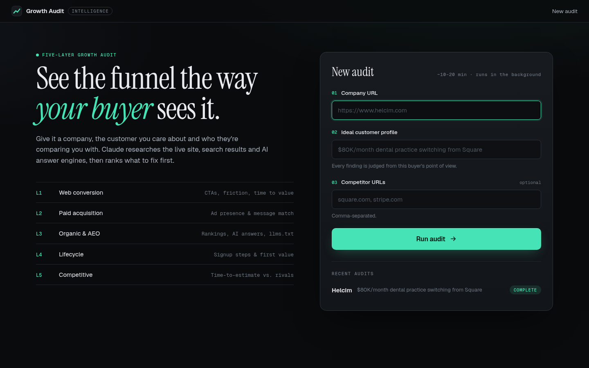
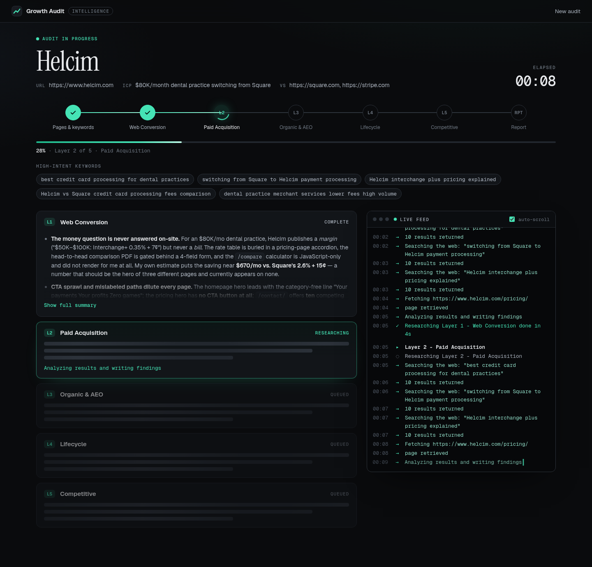
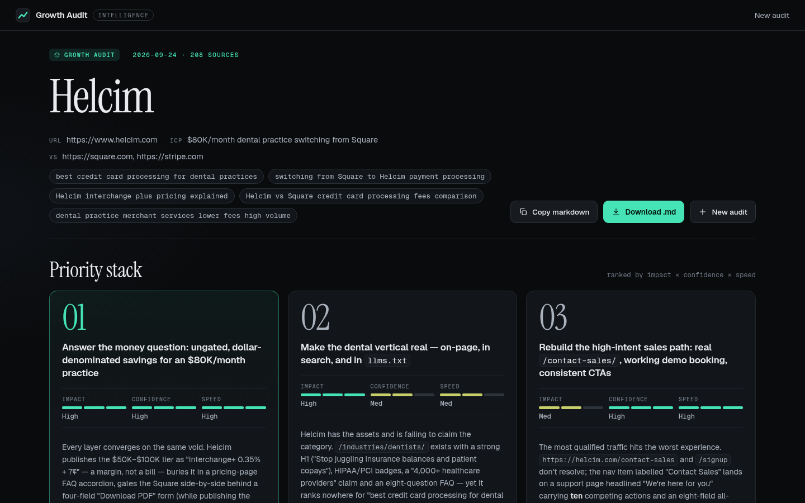

# growth-audit-tool

A reusable tool, with a command line and a web UI, that runs a structured, five-layer growth audit on any company website through the lens of a specific Ideal Customer Profile (ICP). It compares the company against named competitors and writes the findings to a markdown report.

Research runs on the Anthropic API with the server-side **web search** and **web fetch** tools. Pages are also fetched and parsed locally, which gives Claude the page title, headings, CTAs, form fields and schema markup.

## What it audits

| Layer | What it looks at |
|---|---|
| 1. Web Conversion | Homepage, pricing, compare/calculator, contact sales and signup pages. For each page: the primary CTA and the CTAs that compete with it, how clear the message is, friction, steps to a value moment, and missing conversion elements |
| 2. Paid Acquisition | 5 high-intent keywords. For each: whether the company appears in paid results, the ad copy, how well the ad matches its landing page, and the CTA |
| 3. Organic Search and AEO | Organic rankings for the same keywords, an AI answer-engine probe ("what is the best payment processor for [ICP]?"), `/llms.txt`, and FAQ schema on key pages |
| 4. Lifecycle and Post-Signup | The part of the signup flow you can see without creating an account: steps, information required upfront, personalization, first value moment, and onboarding prompts |
| 5. Competitive Comparison | Homepage and pricing analysis for each competitor: how quickly a prospect gets to a cost estimate, the primary CTA, and one specific contrast with the target |

The report has these sections:

1. **Audit Scope**: URL, ICP, date, channels covered and keywords used
2. **What's Working**: one genuine strength per layer
3. **Channel-by-Channel Observations**: each written as *what I observed → why it matters → hypothesis to test*
4. **Priority Stack**: the top 3 opportunities, ranked by impact × confidence × speed
5. **Data I'd Want Before Committing**: 3–4 metrics or analytics questions

Three appendices follow: a page fetch log, the raw notes from each layer, and the sources consulted.

## Setup

Requires Python 3.10+.

```bash
python -m venv .venv
source .venv/bin/activate        # Windows: .venv\Scripts\activate
pip install -r requirements.txt
playwright install chromium      # headless browser for JavaScript-rendered pages

cp .env.example .env             # then edit .env and paste your key
```

`playwright install chromium` is optional. Without it, the audit still runs, but it can't see pages that are built by JavaScript (see [JavaScript-rendered pages](#javascript-rendered-pages)).

`.env` should contain:

```
ANTHROPIC_API_KEY=sk-ant-...
```

Your Anthropic organization must have web search and web fetch enabled in the Claude Console.

## Web UI

```bash
python app.py
```

Then open http://127.0.0.1:5000.



1. **Input form:** enter the company URL, the ICP and competitor URLs, then click **Run audit**. The audit runs in a background thread, so the page stays responsive.
2. **Live progress:** progress streams to the browser over Server-Sent Events, with no page refreshes. The page shows:
   - a step indicator (prep → L1–L5 → report)
   - an overall progress bar and elapsed time
   - a live feed of each search, fetch and analysis step as it happens
   - a card for each layer, which fills in with that layer's summary when it finishes

   You can reload the page or open it in another tab. It replays everything that has happened so far and then carries on live.

   

3. **Results:**
   - The **Priority Stack** comes first: the top 3 opportunities with impact, confidence and speed shown as meters.
   - Each layer has a tab. AI research is tagged in teal: what's working, the observations (observed → why it matters → hypothesis) and the full research notes. Your own **field notes** go in the amber panel next to it. They save automatically as you type and are clearly separated from the AI findings.
   - **Copy markdown** and **Download .md** export the full report. Your field notes are added as an "Analyst Field Notes" section.

   

Options: `--port 8080`, `--host 0.0.0.0` (to share on your network), `--model <id>`.

`--load report.md` opens a report you saved earlier in the results view without running a new audit, which is handy for demos. Any field notes in that file are loaded too.

Audit state lives in memory while the server runs. Each finished report is also written to disk with the same filename the CLI uses, so nothing is lost when you stop the server.

### Deploying to Railway

Railway reads `railway.toml` from the repo root:

```toml
[build]
buildCommand = "bash build.sh"

[deploy]
startCommand = "gunicorn app:app"
```

- **`build.sh`** installs `requirements.txt` and then runs `playwright install --with-deps chromium` on every deploy. Railway needs that step to download the headless browser used for JavaScript-rendered pages; `pip install playwright` alone doesn't include it. `--with-deps` also installs the system libraries Chromium needs (via apt).
- **`gunicorn.conf.py`** is read automatically by the plain `gunicorn app:app` start command. It sets one gthread worker with 16 threads and a 120s timeout. The app needs this because audits live in the worker's memory and the live progress page holds a long-lived SSE connection. gunicorn's defaults (one sync worker, 30s timeout) would block every other request while a stream is open, then kill the stream after 30 seconds.
- **Port:** gunicorn picks up Railway's `PORT` automatically.
- **Procfile:** the start command takes precedence over the `Procfile`, which is kept for other hosts.
- **If the build fails at the Playwright step:** `--with-deps` uses `apt-get`, which only works on Debian/Ubuntu-based build images. If your image can't run it, change the last line of `build.sh` back to `playwright install chromium`. The audit still runs if Chromium then can't start; it logs "Headless browser fallback unavailable" and continues without the browser.

1. Create a Railway project from this GitHub repo.
2. Under **Variables**, add `ANTHROPIC_API_KEY` and `APP_PASSWORD`. You can also add `CLAUDE_MODEL` to change the model from the default `claude-opus-5`. Railway sets `PORT` itself.
3. Under **Settings → Networking**, generate a domain.

Things to know:
- **One worker.** Audits and field notes are kept in the worker's memory. A second worker would have its own separate set of audits, and progress streams would miss events. Threads handle concurrent SSE streams and requests.
- **Data loss on restart.** A redeploy or restart clears in-memory audits and the report files written to the container's disk. Download reports you want to keep.
- **Set `APP_PASSWORD`.** Without it, anyone who finds the URL can start audits billed to your API key. The app logs a warning at startup when it's deployed without one.

### Password protection

When `APP_PASSWORD` is set, every page requires signing in first.
- **Sign-in:** a login page opens a signed session cookie that lasts 30 days and is `HttpOnly` and `SameSite=Lax`. On Railway it's also marked `Secure`.
- **Brute-force protection:** after 5 wrong passwords, that IP address is locked out for 15 minutes.
- **Signing everyone out:** changing `APP_PASSWORD` invalidates all existing sessions. You can also set your own `SECRET_KEY` for signing sessions.
- **Sign out:** a **Sign out** link appears in the top bar.

Without `APP_PASSWORD`, the app stays open, which is fine for running it on your own machine.

`python app.py` also reads `PORT` from the environment. When `PORT` is set, it listens on `0.0.0.0`; otherwise it uses `127.0.0.1:5000`.

## Command line

```bash
python growth_audit.py \
  --url helcim.com \
  --icp '$80K/month dental practice switching from Square' \
  --competitors square.com,stripe.com
```

Put the ICP in **single quotes** if it contains a `$`. Otherwise your shell expands `$80K` into an empty string.

The report is saved in the current directory as `[company-name]-growth-audit-[date].md`, e.g. `helcim-growth-audit-2026-09-24.md`.

### Options

| Flag | Required | Description |
|---|---|---|
| `--url` | yes | The website to audit (`helcim.com`, `https://www.helcim.com` and similar forms all work) |
| `--icp` | yes | The ICP lens used for every judgment |
| `--competitors` | no | Comma-separated competitor URLs |
| `--keywords` | no | Comma-separated keywords for Layers 2–3. If you leave this out, Claude writes 5 ICP-specific keywords |
| `--model` | no | Claude model ID (default `claude-opus-5`) |
| `--resume` | no | Continue an interrupted run: reuse its keywords and completed layers, and only run what's missing |

### Resuming an interrupted run

Each layer is saved to `<company>-growth-audit.checkpoint.json` as soon as it finishes. If a run stops partway, re-run the same command with `--resume` to finish only the missing layers and the final report. A run can stop because the API account runs out of credit, the network drops, or you press Ctrl-C. When the account is out of credit, the tool stops immediately rather than spending more attempts, and it tells you to resume. The checkpoint is deleted after a complete, successful run.

### Progress output

```
[1/8] Fetching pages (target + competitors)
    - Homepage: https://helcim.com
    - Pricing page: https://helcim.com/pricing
    ! Compare / calculator page: not found - tried 6 URL(s)
[2/8] Choosing high-intent keywords
[3/8] Layer 1 - Web Conversion
    / Researching Layer 1 - Web Conversion (84s)
...
[8/8] Writing the audit report
Report saved to /path/to/helcim-growth-audit-2026-09-24.md
```

A full run makes about 8 API calls, each with multiple web searches. Expect it to take roughly 5–15 minutes. It costs a few dollars in API usage, depending on the model and how much research each layer does.

## JavaScript-rendered pages

Each page is fetched with a plain HTTP request first. The page is re-rendered in headless Chromium through Playwright, without you having to do anything, when:
- the raw HTML has fewer than 500 words, or
- the request is blocked (401/403/429/503).

The richer version is kept. Every layer's notes, and the page fetch log, record which method was used for each page (`standard HTTP` or `headless browser (Playwright)`).

When the browser shows key content that the raw HTML didn't contain, the tool flags it as its own finding. That content can be pricing, calls to action, the main headline, forms, structured data such as FAQ schema, or most of the body copy. The finding is added as the first observation under both layers:
- **Layer 1 (Web Conversion):** "Pricing/key content is client-side injected via JavaScript. Visitors on slow connections or with JS disabled cannot see *[the missing content]*. This creates conversion risk on first load."
- **Layer 3 (Organic & AEO):** "Key page content including *[pricing/CTAs/…]* is JavaScript-rendered and not present in raw HTML. This means AI crawlers, search engine bots, and tools like ChatGPT and Perplexity cannot reliably index this content…"

The bracketed parts are filled in from what was actually missing, for example "pricing (12 price mentions, e.g. $349, 0.35%), calls to action such as 'Get started free' … on the pricing page". A word-count footer shows the evidence. Short pages whose content is all in the raw HTML are not flagged.

To use a Chromium you already have instead of Playwright's download, set `PLAYWRIGHT_CHROMIUM_EXECUTABLE=/path/to/chrome`.

## How it stays robust

- **Page fetch failures are recorded, not fatal.** If a page returns an error, times out or can't be found, the failure goes into the fetch log. Claude is told to try `web_fetch` on that URL, and to mark the page unavailable if that also fails.
- **Page discovery.** The tool first looks for pricing, compare, contact sales and signup pages among the homepage's links. If none match, it tries common paths such as `/pricing`, `/compare`, `/calculator`, `/contact-sales` and `/signup`.
- **Completed layers are checkpointed.** An interrupted run can be finished with `--resume` without paying for the finished layers again.
- **Layer failures don't stop the audit.** If one layer's API call fails, the report says so and the other layers still run. If the final synthesis fails, the raw layer notes are still saved.
- **Long research turns** that pause partway (`pause_turn`) are resumed automatically.
- **Refusal fallback.** Requests opt into the API's server-side refusal fallback (`fallbacks: "default"`). If the model declines a request, the API re-runs it on a fallback model. If your account doesn't accept this beta, the tool turns it off and retries.

## Limitations

- **Paid search visibility.** The web search tool returns organic results, not live Google ad auctions. Layer 2 labels each paid-search claim **OBSERVED** or **INFERRED**. It uses indirect evidence such as the Google Ads Transparency Center and dedicated paid landing pages. Where it can't observe ads, it tells you which manual check to run. For real impression share, check Google Ads Auction Insights or a tool like SEMrush or SpyFu.
- **Organic rankings** come from Anthropic's web search index, which only approximates Google's rankings. Treat positions as directional.
- **AI answer engine.** The AEO probe asks Claude, with web search, to answer as a neutral answer engine. That is one engine. ChatGPT, Perplexity and Google AI Overviews may answer differently.
- **Signup flows.** The tool never creates accounts or submits forms. Layer 4 only covers what is publicly visible, plus public onboarding documentation.
- **JavaScript-heavy sites.** Pages built by JavaScript are re-rendered in headless Chromium (see below). If Chromium isn't installed, those pages give thin snapshots, and Claude is asked to use `web_fetch` instead. `web_fetch` doesn't run JavaScript either.
- **Payments-flavoured prompts.** The prompts are written for a payments/fintech audit (e.g. "best payment processor for [ICP]"). For another category, edit the prompts in `answer_engine_probe()` and `generate_keywords()`.
